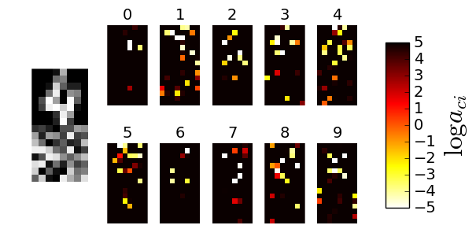

# Dropout-based Automatic Relevance Determination

Here is an implementation of a new method for Automatic Relevance Determination (ARD) in linear models using variational dropout. On left picture, there is an example of an object with concatenated noise, and on right ones trained dropout rates, each heat map corresponds to a weight vector in multiclass model


We use stochastic optimization, but still, we achieved "ARD" and quality is on the level of non-stochastic models.

|                |        | Accuracy |        |   |        | Sparsity |       |
|----------------|--------|----------|--------|---|--------|----------|-------|
|                | VD-ARD | L1-LR    | RVM    |   | VD-ARD | L1-LR    | RVM   |
| MNIST          | **0.926**  | 0.919    | N/A    |   | **69.8%**  | 57.8%    | N/A   |
| Digits         | 0.948  | **0.955**    | 0.945  |   | **75.4%**  | 38.0%    | 74.6% |
| Digits + noise | 0.930  | **0.937**    | 0.846  |   | **87.6%**  | 55.9%    | 85.7% |

It's easy to use

```python
import vdrvc 
import numpy as np
from sklearn.datasets import load_digits
from sklearn.metrics import accuracy_score as acc
from sklearn.cross_validation import train_test_split

X, y = load_digits(return_X_y=True)
X_train, X_test, t_train, t_test = train_test_split(X - np.mean(X, axis=0), y, test_size=0.2)
vd = vdrvc.vdrvc()
vd = vd.fit(X_train, t_train, num_classes=10, batch_size=1000)
```

